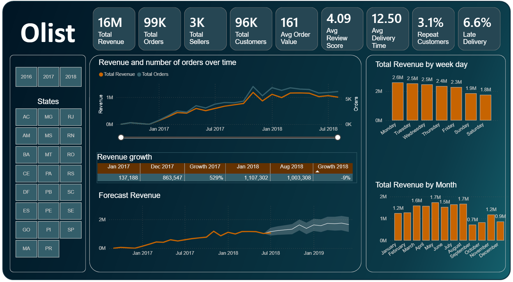

# Hi there 👋, I'm Olesya Drozhzhina

I'm a **Data Analyst with a Business Analysis background** based in London, recently completing a full-time Data Analytics bootcamp. I bring a strong analytical background, experience as a Business Analyst in banking and telecommunications, and hands-on experience with SQL, Python, Excel, and Power BI. I'm now building my portfolio and looking to contribute to data-driven projects.  

---

## 🚀 About Me
- Recently completed **Generation UK & Ireland Data Analytics Bootcamp** (Sep–Dec 2025) with hands-on experience in SQL, Python (Pandas, NumPy, Matplotlib), Excel, and Power BI.
- Experienced in **data cleaning, analysis, visualisation**, and building interactive dashboards for business insights.
- Passionate about **data-driven problem solving** and applying analytics to real-world business challenges.
- Strong communication skills, with experience translating complex requirements for technical and non-technical stakeholders.
- Reach me: [Email](mailto:olesya77@gmail.com) | [LinkedIn](https://www.linkedin.com/in/olesya-drozhzhina)

---

## 🛠️ Skills & Tools

### Data Analytics

### Python Libraries

### Databases & Tools

### Business & BI

---

## 📊 Portfolio & Projects

### 🛒 Olist Store Marketplace Analysis

<table>
<tr>
<td width="50%">
  <h3>🛒 Olist Store Marketplace Analysis</h3>
  

    End-to-end analysis of Brazilian eCommerce data using Power BI. 
    Focus on sales trends, customer retention, logistics, and regional performance.
  

  <a href="https://github.com/olesya-d/Olist_Store_PowerBI/tree/main">View Project →</a>
</td>
<td width="50%">
  
</td>
</tr>
</table>

---

## 💼 Professional Background
- **Business Analyst** (Banking & Telecom, Moscow) – 2012–2014  
  - Collaborated with stakeholders to transform business needs into technical solutions.  
- **QA Engineer** (Bank VTB24, Moscow) – 2010–2012  
  - Conducted testing and validated functionality for banking applications.  

---

## 🎓 Education & Certifications
- **Generation Data Bootcamp**, London – 2025  
- **Microsoft Power Platform Fundamentals (PL-900)** – 2025  
- **M.Sc. in Applied Mathematics and Computer Science**, Moscow State University – 2001  

---

## ⚡ Interests
- Data science & analytics, learning advanced techniques  
- Outdoor activities: skiing, hiking, camping  

